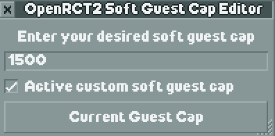

# OpenRCT2 Soft Guest Cap Editor

A plugin for OpenRCT2 that allows you to edit the soft guest cap of your park. The soft guest cap is the maximum number of guests that will spawn naturally in your park.

    

## Installation

Download the Javascript file from the releases page and place it in your OpenRCT2 plugin directory. You can find the plugin directory by going to the toolbox icon in OpenRCT2 and clicking on "Open Custom Content Folder" and then navigate to the plugin folder.

## Thanks

This plugin was built using Bassie's Flex UI library. You can find it [here](https://github.com/Basssiiie/OpenRCT2-FlexUI).
